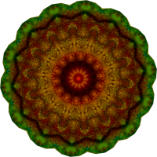

# FreeWolf

  

## Table of contents
- [FreeWolf](#freewolf)
  - [Table of contents](#table-of-contents)
  - [Features](#features)
    - [_Legends_](#legends)
  - [License](#license)

## Features

- **Computer Algebra System** :white_check_mark: :information_source:
	- Sum / Subtract / Multiplication / Divide with fractions, integers, real number and symbols. :heavy_check_mark:
	- Math operations precedence :heavy_check_mark:
	- Sort expressions by type. :heavy_check_mark:
	- Functions support :soon:
		- Exponential. :soon:
		- Potential. :soon:
		- Trigonometric. :soon:
		- Inverse functions. :soon:
	- Finding roots symbolically. :heavy_exclamation_mark: :information_source:
	- Derivative of functions. :heavy_exclamation_mark: 
	- Limits of functions and successions  :heavy_exclamation_mark: :information_source:
	- Optimization. :heavy_exclamation_mark: :information_source:
	- Integrals. :heavy_exclamation_mark: :information_source:
	- Stats :heavy_exclamation_mark: :information_source:
	- ODE & PDE solve. :heavy_exclamation_mark: :information_source:
- **Numeric support** :heavy_exclamation_mark: :information_source:
	- Finding roots. :heavy_exclamation_mark: :information_source:
	- Optimization. :heavy_exclamation_mark: :information_source:
	- Integrals. :heavy_exclamation_mark: :information_source:
	- Stats :heavy_exclamation_mark: :information_source:
	- ODE & PDE solve. :heavy_exclamation_mark: :information_source:

### _Legends_
- :white_check_mark: Not done yet but started. _(Included in next release)_
- :heavy_exclamation_mark: In road map _(Included in next release)_
- :soon: Support will arrive early. _(Included in next release)_
- :heavy_check_mark: Done. _(Included in current release)_
- :information_source: Feature under development yet.

## License
    This program is free software: you can redistribute it and/or modify
    it under the terms of the GNU General Public License as published by
    the Free Software Foundation, either version 3 of the License, or
    (at your option) any later version.

    This program is distributed in the hope that it will be useful,
    but WITHOUT ANY WARRANTY; without even the implied warranty of
    MERCHANTABILITY or FITNESS FOR A PARTICULAR PURPOSE.  See the
    GNU General Public License for more details.

    You should have received a copy of the GNU General Public License
    along with this program.  If not, see <https://www.gnu.org/licenses/>.